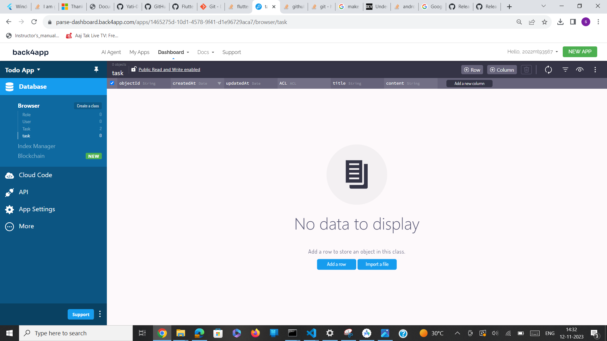
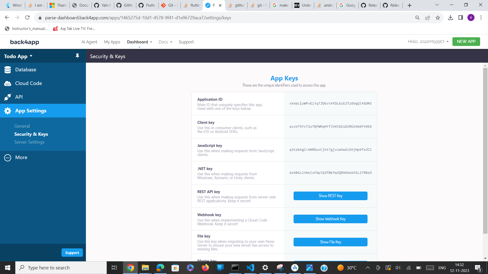
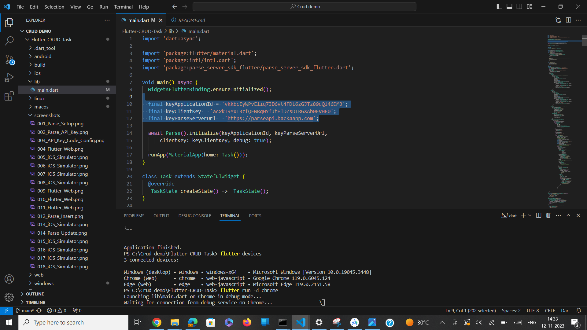
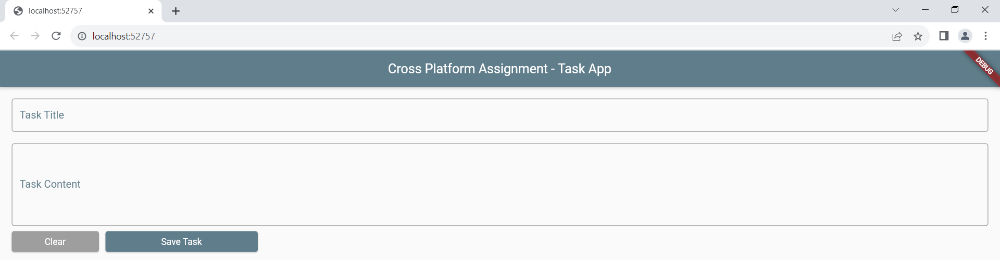
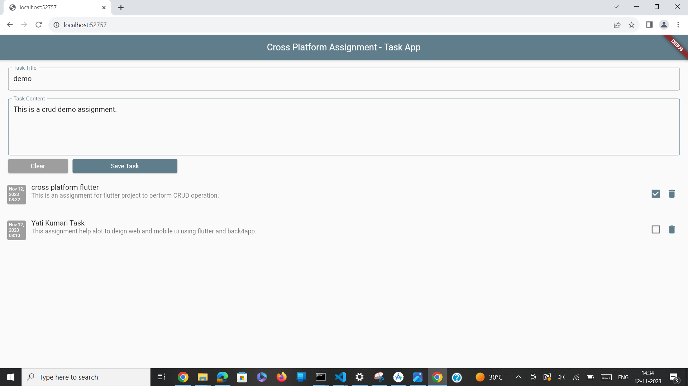
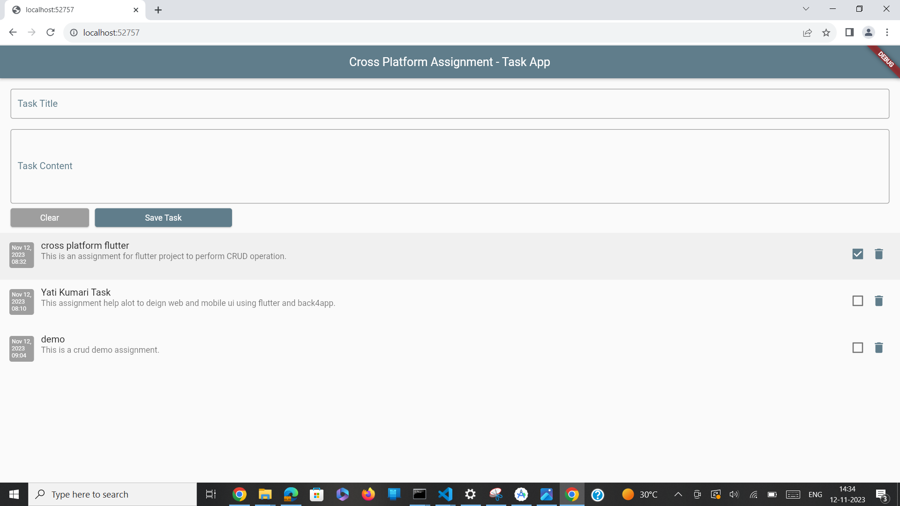
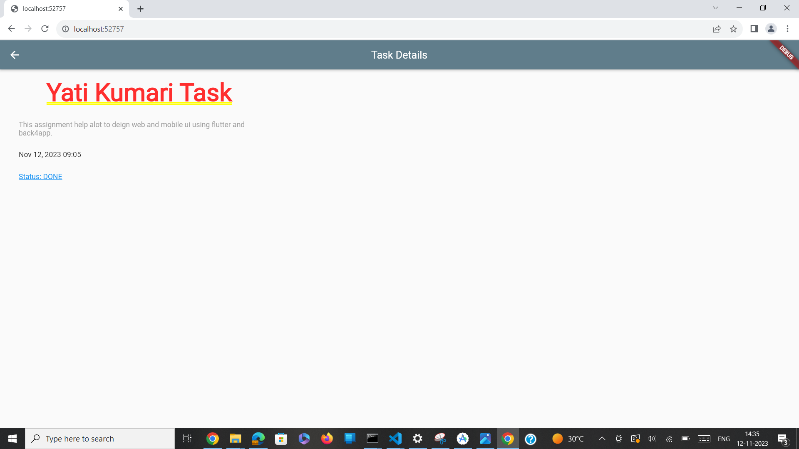
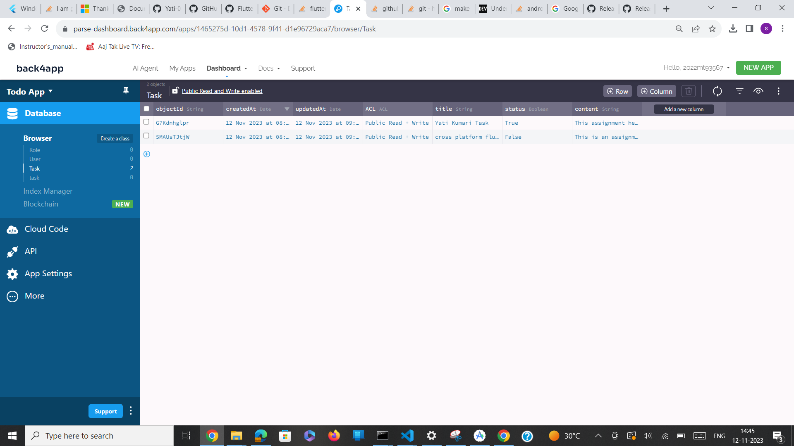

# Flutter Application with Back4App Integration

> Create a Flutter app that connects to Back4App, a Backend-as-a-Service (BaaS) platform, to manage tasks.
> 
> Set-up the Back4App backend, creating the Flutter app to implement save, delete, update functionality to interact with the backend.

#### Software, Tools and SDKs

- [macOS (Sonoma)](https://www.apple.com/in/macos/sonoma)
- [Windows 11 or Above](https://www.microsoft.com/software-download/windows11)
- [XCode](https://developer.apple.com/xcode)
- [Android Studio](https://developer.android.com/studio)
- [GitHub](https://github.com)
- [Open JDK 17](https://openjdk.org/projects/jdk/17)
- [Chrome](https://www.google.com/chrome)
- [VS Code](https://code.visualstudio.com/)
- [Home Brew](https://brew.sh)
- [Cocoa Pods](https://formulae.brew.sh/formula/cocoapods)
- [Flutter SDK](https://flutter.dev)
- [Terminal](https://support.apple.com/en-in/guide/terminal/welcome/mac)

<sub>
Mac OS is required for running iOS Application.
</sub>
<br>
<sub>
Any text editor is sufficient, but VS Code is preferred.
</sub>

#### Development Environment Configuration

- Install above Softwares, Tools and SDKs.
- Setup Flutter SDK and Path from Terminal:
   ```
   $ sudo softwareupdate --install-rosetta --agree-to-license
   $ cd ~/development
   $ unzip ~/Downloads/flutter_macos_3.13.8-stable.zip
   $ export PATH="$PATH:`pwd`/flutter/bin"
   ```
- Run ```flutter doctor``` from Terminal to validate the Flutter SDK installation.
- Configure XCode Command Line Tools from Terminal:
   ```
   $ sudo xcode-select -s /Applications/Xcode.app/Contents/Developer
   $ sudo xcodebuild -runFirstLaunch
   ```
- Accept XCode licence from Terminal:
   ```
   $ sudo xcodebuild -license
   ```
- Download and install iOS Simulator from Terminal:
   ```
   $ xcodebuild -downloadPlatform iOS
   ```
- Run below command from Terminal to start the iOS Simulator.
   ```
   $ open -a Simulator
   ```
- Install Cocoa Pods via HomeBrew from Terminal:
   ```
   $ /bin/bash -c "$(curl -fsSL https://raw.githubusercontent.com/Homebrew/install/HEAD/install.sh)"
   $ brew install cocoapods
   ```
- For Android, run below command to configure the flutter directory and Android SDK Tools from Terminal:
   ```
   $ flutter config --android-studio-dir=<your_path_to_android_studio_directory>
   $ flutter doctor --android-licenses
   $ export ANDROID_HOME=~/Library/Android/sdk
   $ export PATH=$ANDROID_HOME/emulator/:$PATH
   $ export PATH=$ANDROID_HOME/platform-tools/:$PATH
   $ export PATH=$ANDROID_HOME/cmdline-tools/latest/bin/:$PATH
   ```
- Create a emulator named (Test_Android_Device) from Android Virtual Device Manager or via Terminal:
   ```
   $ avdmanager create avd -n Test_Android_Device -k "system-images;android-25;google_apis;x86"
   ```
- Run below command to launch the Test_Android_Device from Terminal:
   ```
   $ adb devices
   $ cd $ANDROID_HOME/emulator;
   $ nohup ./emulator -avd Test_Android_Device -no-snapshot -no-boot-anim -wipe-data
   ```
- To enable Web for Flutter Application, run below command from Terminal:
  ```
  $ flutter config --enable-web
  ```

#### Running the Application

> Flutter commands to get the dependencies and necessary packages:
   ```
   $ flutter pub get
   $ flutter pub outdated
   $ flutter pub upgrade
   ``` 

> To list all the configured devices, run below command from Terminal:
   ```
   $ flutter devices
   
   4 connected devices:

   iPhone 15 Pro Max (mobile)    • 6981250D-DD66-4CCE-96D5-EF002F2AB307 • ios (simulator)
   macOS (desktop)               • macos   • darwin-arm64 (macOS 14.0 23A344 darwin-arm64)
   Chrome (web)                  • chrome  • web-javascript (Google Chrome 118.0.5993.88)
   Test_Android_Device (mobile)  • Test_Android_Device  • android (emulator)
   ```
> Launch the applicaiton from Terminal via below commands
   ```
   Chrome Browser: flutter run -d chrome
   iOS Simulator: flutter run -d <iOS_Device_Name>
   Android Emulator: flutter run -d <Android_Device_Name>
   ```
> This will launch the application in respective environment:
   ```
   $ flutter run -d chrome  
   Launching lib/main.dart on Chrome in debug mode...
   Waiting for connection from debug service on Chrome...             12.5s
   This app is linked to the debug service: ws://127.0.0.1:49834/BtFIx-Lk_fU=/ws
   Debug service listening on ws://127.0.0.1:49834/BtFIx-Lk_fU=/ws
   ```
   ```
   $ flutter run -d 6981250D-DD66-4CCE-96D5-EF002F2AB307
   Launching lib/main.dart on iPhone 15 Pro Max in debug mode...
   Running Xcode build...                                                  
    └─Compiling, linking and signing...                      2,384ms
   Xcode build done.                                            9.1s
   [VERBOSE-2:FlutterDarwinContextMetalImpeller.mm(37)] Using the Impeller rendering backend.
   ```

#### Application Features

- Developed for Web and Mobile, tested on Chrome and iOS Simulator.
- Setup Back4App account, which serves as a BaaS.
- Integrated the Flutter applicaiton with Back4App backend via Secret Keys.
- Added functionlaity such as Add, Update, Delete.

#### Application Screenshots

> Back4App Dashboard
> Back4App Dashboard


> Back4App API Key


> Configuring API Key in Flutter Application


> Flutter Web Application


> Adding Task - Web
<p float="left">


</p>

> Task Updated in Web Application


> Adding Task - Web Application


> Updating Status as Done from Web Application


> Back4App Database Updated the Status


> Adding a Task and Deleting it from Mobile - iOS
<p float="left">


</p>

> Opening new screen with task details
<p float="left">


</p>

#### References

- https://docs.flutter.dev/get-started/install/macos
- https://developer.apple.com/forums/thread/697220
- https://developer.android.com/tools/avdmanager
- https://docs.flutter.dev/reference/flutter-cli

#### Assignment Submission Done By:

> Yati Kumari (2022MT93567)
